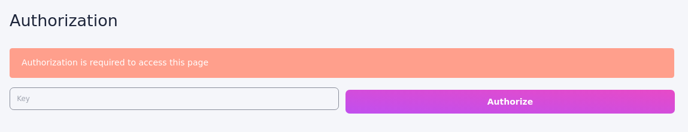

# Security

## UI & API protection



API can be protected by setting API key in the [config](./configuration). You will be required to enter key each time you visit UI.

When using API, you will also need to provide `Authorization` header:

```js
Authorization: Bearer <api key>
```

## Steam API

When API key is provided, stream API is protected using [JSON Web Token](https://jwt.io/).

You can also have different key for streaming API using `security.streamApi.key` [config](./configuration) parameter.

_Example usage:_

```js
import { sign } from 'jsonwebtoken'

const url = `/stream/${encodeURIComponent(
    sign(
        {
            torrent: '08ada5a7a6183aae1e09d831df6748d566095a10',
            fileType: 'video',
        },
        key
    )
)}`
```

This API will have encoded parameters, so it's **safe to share it publicly**. It will automatically expire (configurable via `security.streamApi.maxAge`). 
