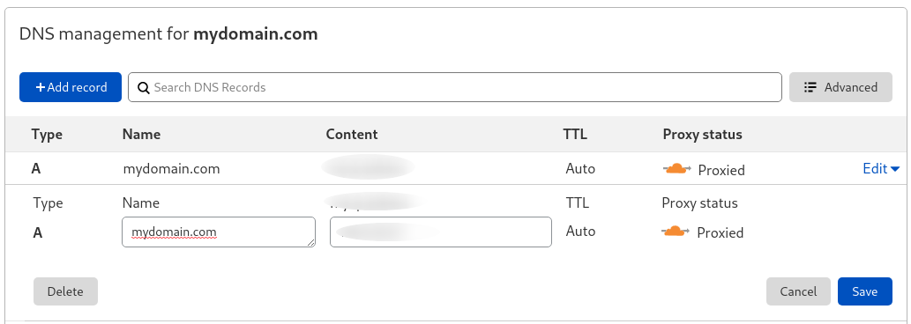

# Setup

# Heroku

[](https://heroku.com/deploy?template=https://github.com/KiraLT/torrent-stream-server)

> _Heroku forbids P2P services, so your account can be suspended ([learn more](https://github.com/KiraLT/torrent-stream-server/issues/32))_

Deploy to Heroku with one click, works with free tier!

## Okteto

[](https://cloud.okteto.com/deploy?repository=https://github.com/KiraLT/torrent-stream-server&branch=master)

> _Okteto forbids P2P services, so your account can be suspended ([learn more](https://okteto.com/legal/))._

Deploy to [Okteto](https://okteto.com) with one click, works with free tier!

## NPM package

[](https://www.npmjs.com/package/torrent-stream-server)

The npm module can be installed with npm or yarn on a local machine, depending on your preference.

```shell
npm install -g torrent-stream-server
```

Once installed, you can always run `torrent-stream-server --help` to see a list of available commands.

### Run server

```shell
torrent-stream-server serve
```
Go to http://127.0.0.1:3000

### Configuration

You can pass [configuration file](./configuration) with `-c` argument:

```shell
torrent-stream-server serve -c config.json
```

## NPX

You can run using [NPX](https://www.npmjs.com/package/npx):

```shell
npx torrent-stream-server serve
```

## From source

[](https://github.com/KiraLT/torrent-stream-server)

```shell
git clone https://github.com/KiraLT/torrent-stream-server.git
cd torrent-stream-server
npm install
npm run build
npm run start
```

Go to http://127.0.0.1:3000

## Docker

[](https://github.com/users/KiraLT/packages/container/package/torrent-stream-server)

This will start a new instance with latest version listening on `3000` port (see [all versions](https://github.com/users/KiraLT/packages/container/torrent-stream-server/versions)). 

```shell
docker run -d --name torrent-stream-server ghcr.io/kiralt/torrent-stream-server:latest
```

### Custom port

If you'd like to be able to access the instance from the host without the container's IP, standard port mappings can be used:

```shell
docker run -d --name torrent-stream-server -p 80:3000 ghcr.io/kiralt/torrent-stream-server:latest
```

You'll be able to access it on http://localhost

## Kubernetes

_Deploy with Helm3_


```shell
# Add repository (add only once)
helm3 repo add torrent-stream-server https://kiralt.github.io/torrent-stream-server
helm3 repo update

# Install or update
helm3 upgrade --install torrent-stream-server torrent-stream-server/torrent-stream-server
```

### Configuration

You can change configuration by providing [values.yaml](https://github.com/KiraLT/torrent-stream-server/blob/master/chart/values.yaml).

#### Examples

##### Add custom domain

```shell
helm3 upgrade --set ingress.host=domain.com --install torrent-stream-server torrent-stream-server/torrent-stream-server
```

##### Set ENV variables

```shell
helm3 upgrade --set env.API_KEY="my key" --install torrent-stream-server torrent-stream-server/torrent-stream-server
```

## VPS

Cheapest way to host something is using VPS (Virtual private server). Check [The safest countries to download torrents](https://www.downloadprivacy.com/safest-countries-to-download-torrents).

### Setup

1. When buying VPS choose latest ubuntu OS
2. Connect to server via SSH (use [PuTTY](https://www.putty.org/) on Windows).
3. Fetch latest packages info: `sudo apt update`
4. Update all packages: `sudo apt upgrade`
5. Add NodeJS package: `curl -fsSL https://deb.nodesource.com/setup_14.x | sudo -E bash -`
6. Install NodeJS: `sudo apt-get install -y nodejs`
7. Install [PM2](https://www.npmjs.com/package/pm2) process manager: `sudo npm install pm2 -g`
8. Install Torrent Stream Server: `sudo npm install torrent-stream-server -g`
9. Start Torrent Stream Server on port 80 with process manager: `sudo PORT=80 pm2 --update-env start torrent-stream-server -- serve`

> Go to http://127.0.0.1 (replace `127.0.0.1` with your server IP). If you get unsafe warning - check how to [bypass it on chrome](https://www.technipages.com/google-chrome-bypass-your-connection-is-not-private-message).

### SSL & custom domain

Easiest way to connect custom domain and SSL is using [Cloudflare DNS](https://www.cloudflare.com/dns/). Forward your custom DNS to Cloudflare, then add an `A` record with your server's IP address. Cloudflare will automatically proxy all requests with that domain and free SSL certificate.


